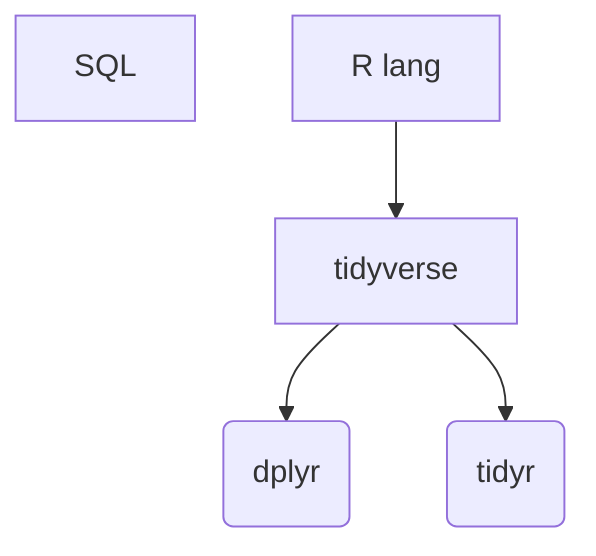

### Hi there 👋

- 📄 I use R([tidyverse](https://www.tidyverse.org/)) in work and in my own projects. R helps me to prepare data and economy my time. Also R community have useful libraries(e.g. [dplyr](https://dplyr.tidyverse.org/) and [tidyr](https://tidyr.tidyverse.org/)), which I use in my usual practice.
- 💬 Ask me about R, tidyverse, SQL
- 📫 How to reach me: [@_KonstantinR_](https://twitter.com/_KonstantinR_)  

