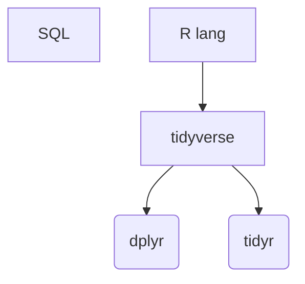

### Hi there 👋

- 💬 Ask me about R, tidyverse, SQL
- 📫 How to reach me: [@_KonstantinR_](https://twitter.com/_KonstantinR_)  

```mermaid
 flowchart TD
    A[SQL]
    B[R lang]
    B-->C[tidyverse]
    C-->D(dplyr);
    C-->E(tidyr)
```
